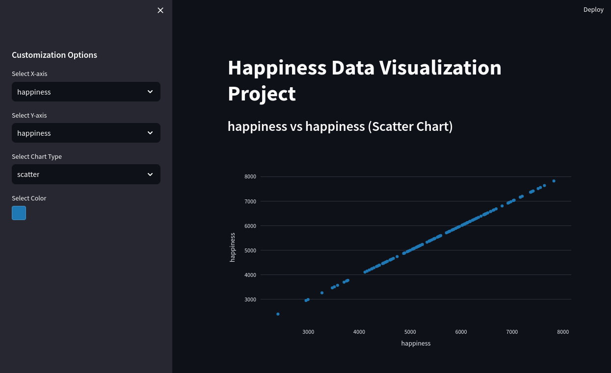
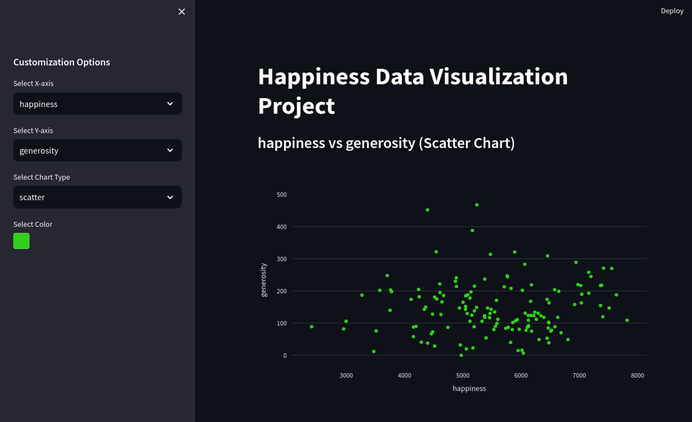

# Happiness Data Visualization Project



A data visualization project that allows you to explore and visualize happiness data using Streamlit, Pandas, and Plotly Express.

## Table of Contents

- [About](#about)
- [Features](#features)
- [Installation](#installation)
- [Usage](#usage)
- [Customization](#customization)
- [Contributing](#contributing)
- [License](#license)

## About

This project is designed to help you visualize happiness data and gain insights into the factors affecting happiness across countries and years. It leverages Streamlit for creating an interactive web application, Pandas for data manipulation, and Plotly Express for generating interactive plots.



## Features

- Select X-axis and Y-axis variables for plotting.
- Choose from various chart types: scatter, line, or bar charts.
- Customize chart colors to match your preferences.
- Filter data by year (if available in the dataset).
- Interactive and user-friendly interface.

## Installation

1. Clone the repository:

   ```shell
   git clone https://github.com/wolflergf/Happiness.git
   ```
2. Navigate to the project directory:

   ```shell
   cd Happiness
   ```

3. Install the required packages:

   ```shell
   pip install -r requirements.txt
   ```

## Usage

To run the application, use the following command:

```shell
streamlit run app.py
```

This will start the Streamlit server and open the application in your default web browser.

## Customization

You can customize the application by modifying the `app.py` file. Here you can add new features, change the layout, or modify the data processing steps.

## Contributing

Contributions are welcome! Please read the [CONTRIBUTING.md](CONTRIBUTING.md) for details on how to contribute to this project.

## License

This project is licensed under the MIT License - see the [LICENSE.md](LICENSE.md) file for details.

## Acknowledgments

- [Streamlit](https://streamlit.io/)
- [Pandas](https://pandas.pydata.org/)
- [Plotly Express](https://plotly.com/python/plotly-express/)

## Contact

If you have any questions, feel free to reach out to me at [wolflergf@gmail.com.com](mailto:wolflergf@gmail.com.com).
